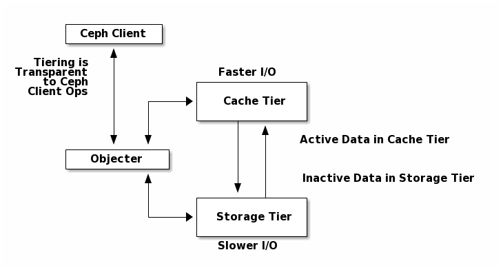

# 1. 简介




上图展示的是Ceph 存储系统中的分级缓存（Cache Tiering）机制。简单来说，这是一种通过“高速缓存盘”来加速“慢速存储盘”读写性能的技术。

Ceph 的分级缓存机制将存储分为两个层级：
- 缓存层（Cache Tier）： 由相对较快但昂贵的设备组成（例如 SSD 固态硬盘）。它的作用是处理频繁访问的“热数据”。
- 存储层（Storage Tier）： 由相对较慢但便宜的设备组成（例如 HDD 机械硬盘）。它的作用是存储备份数据或不常访问的“冷数据”。

图中的流程展示了数据是如何在客户端、对象网关和两个存储层之间流动的：
- Ceph 客户端（Ceph Client）：客户端负责发起读写请求，它完全不需要知道数据到底存在哪个层级，整个分级过程对它是“透明的”。
- 对象网关（Objecter）：这是客户端和存储层之间的“大脑”。当写入时，Objecter 会决定将数据直接写入 Cache Tier（因为 Cache Tier 速度更快）。当读取时，Objecter 会先去 Cache Tier 查找数据。如果命中（数据在缓存里），直接返回给客户端；如果没命中，它会去 Storage Tier 找，并将数据复制或迁移回 Cache Tier 供下次快速访问。
- 分级代理（Tiering Agent）：它是管理数据在两个层级间移动的“管家”。它决定什么时候将 Cache Tier 中不活跃（inactive）的数据“冲刷”（flush）回 Storage Tier，什么时候将 Storage Tier 中活跃（active）的数据提取到 Cache Tier。

# 2. 如何使用 Cache Tier

## 2.1. 创建 Cache Tier
在创建 Cache Tier 之前，需要提前部署好一个基本的集群，并且提前创建好一个数据存储池和一个缓存池。集群部署可以参考 [如何使用ceph-deploy工具部署Ceph多机集群](https://henglgh.github.io/articles/posts/ceph/Ceph-14-2-22-如何使用ceph-deploy工具部署Ceph多机集群)，本文不再赘述。

为了达到更好的性能，一般情况下，缓存池应选择 replicated 类型的，数据池应该选则 erasure 类型的。

**将 Cache Tier 与存储池绑定**

```bash
ceph osd tier add fs_data cache_pool
```

**设置 Cache Tier 缓存模式**

```bash
ceph osd tier cache-mode cache_pool writeback
```

**将客户端请求重定向到缓存池**

```bash
ceph osd tier set-overlay fs_data cache_pool
```

如果不想修改Cache Tier的配置，到此，Cache Tier就创建完成了。

## 2.2. 配置 Cache Tier
Cache Tier的配置主要是针对缓存池的，而不是数据池。通过调整缓存池的相关指标配置来控制哪些对象应该被提升到热数据层（hot tier）或被移出到冷数据层（cold tier）中。

### HitSet 配置
Ceph使用一种`对象访问频率管理机制`来实现缓存淘汰策略和对象晋升策略。这种机制基于`age`和`temperature`。age表示对象自上次访问以来的时间（越久越“老”）,temperature表示对象的活跃程度，即近期被访问的频繁程度。

HitSet 是 Ceph 中的一个数据结构，用于记录在过去某个时间段内被访问过的对象集合。每个 HitSet 对应一个时间窗口（例如每小时一个），形成一个时间序列。Ceph 会维护多个 HitSet（由 `hit_set_count` 控制），比如最近 24 小时的访问记录。

当客户端请求读取某个对象时，Ceph 会检查该对象是否出现在`最近`的若干个 HitSet 中。如果出现，则认为该对象“活跃”，可以考虑将其异步promote到缓存层。具体检查几个 HitSet，由 `min_read_recency_for_promote` 决定。比如：
```bash
ceph osd pool set cache_pool min_read_recency_for_promote 1
```
该参数的值有3中情况：
- 0：不管HitSet中有没有，都始终都做 promote。
- 1：只检查当前 HitSet（最近的时间窗口）。如果在其中，就提升；否则不提升。
- 大于 1 的整数：检查最近 N 个 HitSet（N = 参数值），只要在任意一个中出现，就提升。

这里的`时间窗口`是由 `hit_set_count` 和 `hit_set_period` 共同决定的。比如 `hit_set_period=3600` 秒（1小时），`hit_set_count=24`，则每个 HitSet 代表一小时，共 24 小时的历史。

> 时间窗口越长，且 min_read_recency_for_promote 和 min_write_recency_for_promote 越高，ceph-osd 守护进程消耗的 RAM 就越多。因为所有 HitSet 都会被加载到内存中（RAM）。

```bash
# 缓存池使用的目标查找算法
ceph osd pool set cache_pool hit_set_type bloom

# 缓存池使用的数据命中集合个数
ceph osd pool set cache_pool hit_set_count 1

# 缓存池使用的数据命中集合存在时间
ceph osd pool set cache_pool hit_set_period 3600

# 数据从数据池 promote 到缓存池时需要遍历的hit_set的个数
ceph osd pool set cache_pool min_read_recency_for_promote 1

# 缓存池中能够存储 object 的最大数量
ceph osd pool set cache_pool target_max_objects 1000

# 存储池低速 flush 数据到数据存储池时被修改的数据容量占比
ceph osd pool set cache_pool cache_target_dirty_ratio 0.4

# 存储池高速 flush 数据到数据存储池时被修改的数据容量占比
ceph osd pool set cache_pool cache_target_dirty_high_ratio 0.6

# 存储池高速 evict 数据时被已经使用的数据容量占比
ceph osd pool set cache_pool cache_target_full_ratio 0.8

# 缓存池 flush 数据到数据存储池之前 object 在缓存池中驻足的时间
ceph osd pool set cache_pool cache_min_flush_age 10

# 缓存池 evict 数据之前 object 在缓存池中驻足的时间
ceph osd pool set cache_pool cache_min_evict_age 15
```

如果设置为 0，表示始终都做 promote。如果设置为 1，表示遍历当前 hit set。设置的个数要介于 0 到 hitset 总个数之间。

## 2.3. 注意事项

以上所有参数都要配置，尤其是 `hit set` 的配置。hit set 在计算 flush/evict 比例、object promote 流程中扮演者很重要角色。

上述设置缓存池总容量时，既可以通过 `target_max_objects` 设置，也可以通过 `target_max_bytes` 设置；可以同时设置这两个参数，可以以只设置其中一个。如果设置 target_max_objects，将根据 object 数量去计算占比。如果设置 target_max_bytes，将根据数据使用字节数计算占比。如果同时设置，将分别计算占比，然后对比选择出最大占比。

默认情况下，单次处理单个 PG 中的 object 数量为 10；生产环境发现这种情况下，flush 和 evict 的速度会比较慢，导致缓存池会一直处于 full 状态，进而导致很多 OSD l slowops；可以根据实际操作调整缓存池 OSD 的参数：`osd_pool_default_cache _max_evict_check_size`；比如：`ceph tell osd.* injectargs --osd_pool_default_cache_max_evict_check_size 100`。

# 参考资料

- [https://docs.ceph.com/en/nautilus/architecture/#cache-tiering](https://docs.ceph.com/en/nautilus/architecture/#cache-tiering)
- [https://docs.ceph.com/en/nautilus/rados/operations/cache-tiering](https://docs.ceph.com/en/nautilus/rados/operations/cache-tiering)
