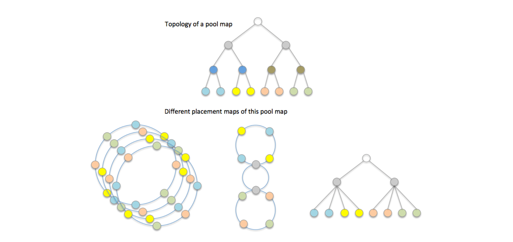

# 1. 概述
DAOS使用pool map来创建一系列放置映射（placement maps），这些映射被用于计算对象布局的算法。该算法是基于一致性哈希算法，使用对象的ID、对象的概要、以及其中一个放置映射来生成对象的布局。DAOS使用一种模块化方法，允许不同的对象使用不同的放置映射来获得应用程序所需的性能特征。

&nbsp;
&nbsp;
# 2. 放置映射
放置映射本质上是一个抽象的，经过排列过的存储池映射。它不一定包含存储池映射的所有细节信息。相反，它只保留了相关组件关系，该组件关系用于分发对象分片以满足应用程序的弹性和性能要求。

放置映射不会去维护相关联存储池映射组件状态和任何特征的副本，仅仅是引用存储池映射组件。所以，每次DAOS根据一个放置映射计算出某个对象的分布时，它还需要从存储池映射中检查相关联组件的状态和属性。这为间接内存访问增加了一个额外的步骤，但是当一个DAOS存储池有很多放置映射而只有一个存储池映射时，这可以显著减少缓存污染和内存消耗。

如上图所示，一个存储池可以具有多个不同类型的放置映射，因为不同的应用程序可能具有不同的容错和性能要求。此外，同一个放置映射可以有很多实例，以便可以通过“负载解聚”技术来加速数据的重建和再平衡过程。

DAOS目前使用包括2种放置映射算法：Jump Consistent Hashing algorithm和Ring Consistent Hashing algorithm。

## 2.1. Jump Placement Map
Jump Placement Map是DAOS中默认的放置映射。它使用跳跃一致性哈希算法（Jump Consistent Hashing algorithm）在不同容错域之间伪随机分布对象。这会将他们分布到尽可能远的远离彼此的容错域中，以避免当某个故障事件影响整个容错域的情况下发生的数据丢失的出现。另外，当系统的物理配置发送变化时，它可以让系统之间地数据迁移变得更加有效。

## 2.2. Ring Placement Map
Ring Placement Map是在开发DAOS时原先使用地放置映射。它使用了一个环形内存结构，将targets以某种模式放置到环上。这样，对于给定的环上的任何一个随机位置，该位置以及其邻居在物理上将位于不用的容错域中。这使得计算放置位置的速度非常快，同时也使得动态修改变得非常困难。目前DAOS中不再使用它了，因为它不支持DAOS所需的几种较新的API方法，特别是服务器的reintegration, drain, and addition方法。