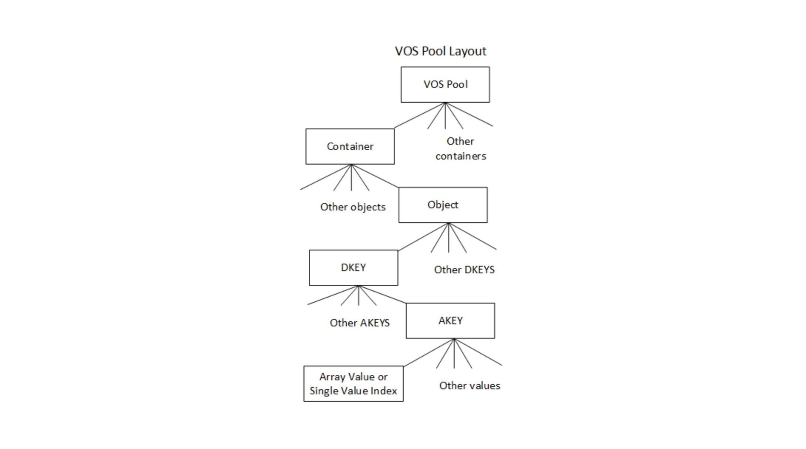
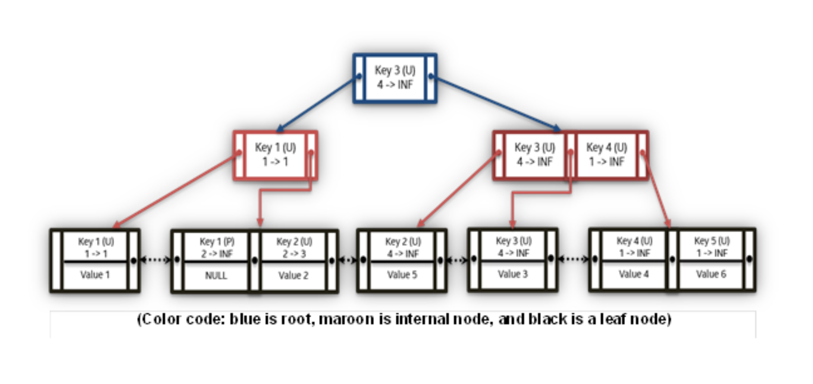
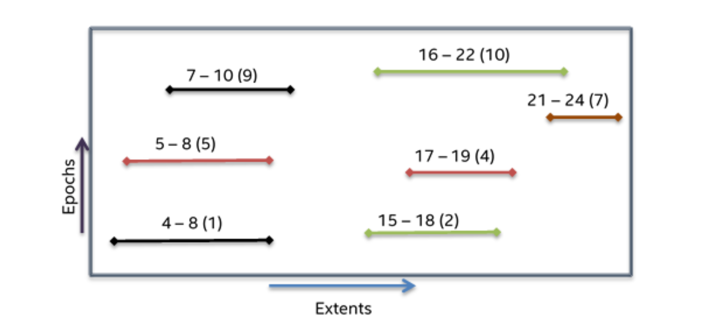
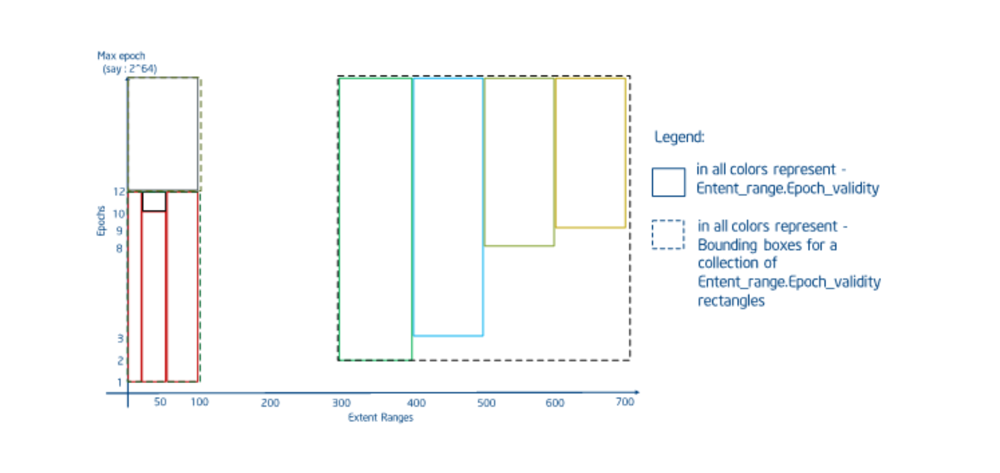
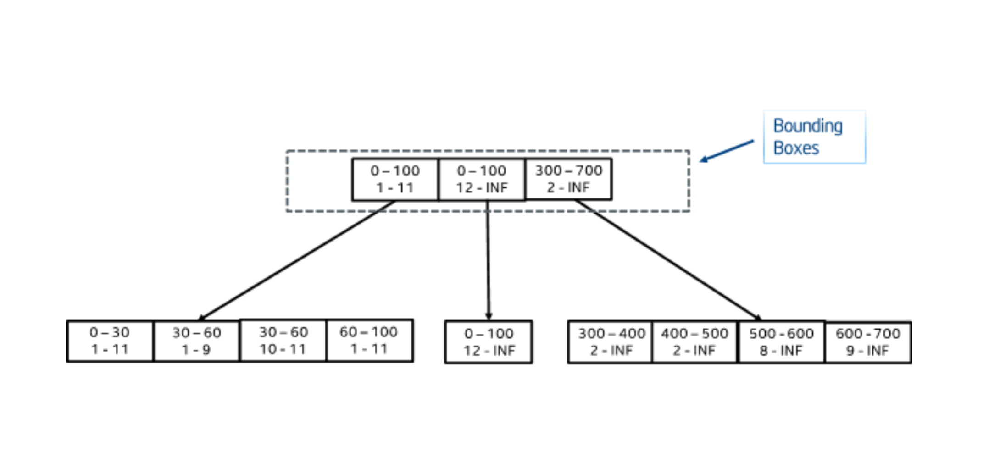
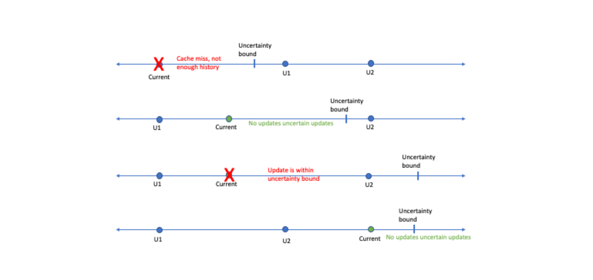
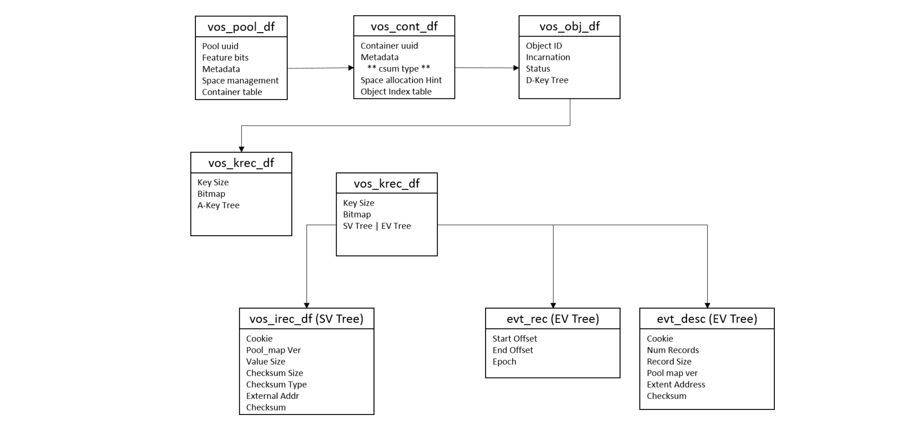
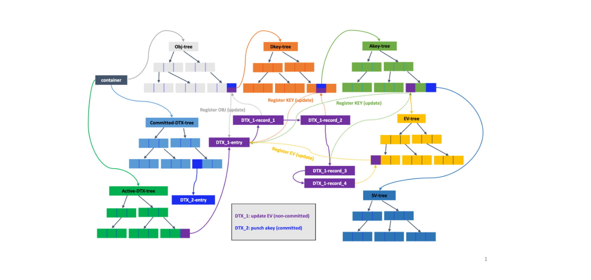

# 1. 版本化对象存储(VOS)
版本对象存储（VOS）负责提供和维护一个持久化对象存储，该持久化存储支持对DAOS存储池中单个分片的字节粒度访问和版本化。它将元数据保存在持久化内存中，将数据存储在持久化内存中或者块设备中（具体取决于可用的存储和性能需求）。它必须以最小的开销提供此功能，以便性能在延迟和带宽方面尽可能接近底层硬件的理论性能。其内部数据结构（持久化内存和非持久化内存）必须要支持最高级别的并发性，以便吞吐量可以在现代化处理器架构的核心上扩展。最后，也是至关重要的，它必须验证所有持久化对象数据的完整性，以消除在正常操作和所有可能可恢复故障的条件下出现的静默数据损坏的可能性。


## 1.1. 基于持久内存的存储
### 1.1.1. 基于内存的存储
VOS的设计使用了一个持久化内存存储模型，该模型利用了新的NVRAM技术，让以字节粒度、亚微秒级存储访问称为可能。于传统存储系统相比，应用程序、系统的元数据、以及小型碎片化和未对其的I/O性能发生了翻天覆地的变化。

VOS依赖基于日志的架构，该架构主要使用持久化内存来维护内部的持久化元数据索引。实际的数据可以直接存储在持久化内存中，也可以存储在基于块的NVME存储中。DAOS服务有2层存储：存储级别的内存(SCM)和NVME存储。SCM用于存储字节粒度的应用数据和元数据，NVME用于批量的应用数据。与使用PMDK来访问SCM一样，SPDK被用来无缝且高效的访问NVME存储。

当前DAOS存储模型涉及到3个DAOS服务端的xstreams(每个xstream与单个物理cpu核心绑定),其中一个xstream映射到一块NVME固态硬盘设备。DAOS存储分配器可以在SCM上通过使用一个PMDK pmemobj存储池分配空间，也可以在NVME上通过使用SPDK blob来分配空间。

服务端的所有本地元数据都将存储在每个服务端的SCM中的pmemobj存储池中，并将包括所有当前的和相关的NVME设备、存储池、以及xstream映射信息。可以参考BIO（Blob I/O）模块了解更多有关NVMe、SPDK以及每个服务端的元数据信息。

在开发和修改VOS层时需要特别小心，因为任何bug都可能导致持久化内存中的数据结构损坏。因此，尽管存在硬件ECC，VOS依然会对其持久性数据结构进行校验和计算。

### 1.1.2. 轻量级I/O协议栈：PMDK库
VOS利用PMDK开源库，提供了一个完全在用户空间的轻量级I/O堆栈。

尽管持久化内存可以通过直接加载/存储来访问数据，但是更新操作会经过多个级别的缓存，包括处理器L1/2/3缓存和NVRAM控制器。只有在显示刷新所有这些缓存后，数据的持久化才能得到保证。

VOS在持久化内存中维护内部数据结构，该结构必须保持一定程度的一致性，以便在发生意外崩溃或者断电后，在不丢失持久化数据的情况下，操作可以恢复。对于一个请求的处理通常会导致多个内存的分配和更新，这些分配和更新必须是以原子方式应用。

因此，必须在持久化内存之上实现事务接口，以保证内部的VOS一致性。值得注意的是，这种事务与DAOS的事务模型机制不同。在处理传入的请求是，持久化内存事务必须要保证VOS内部数据结构的一致性，无论其epoch的编号如何。

持久化内存之上的事务可以通过多种不同的方式实现，例如撤消日志、重做日志、两者的组合或写入时复制。

PMDK是一个用于使用持久化内存的开源库集，尤其是对NVRAM进行了优化。其中包括libpmemobj库，该库实现了一个称为持久化内存池，它是一个可重定位的持久化堆（树形结构）。libpmemobj库中包含内存分配、事务和持久化内存编程的通用工具。事务是一个本地的线程（不是多线程），并且依赖于撤销日志。正确使用API可以确保在服务器发生故障后打开存储池时，所有的内存操作都会回滚到上一次提交的状态。VOS利用此API来确保VOS内部数据结构的一致性，即使在服务器发生故障的情况下，也是如此。

## 1.2. VOS设计思想
版本化对象存储通过将VOS存储池(vpool)初始化为一个DAOS存储池的一个分片来为DAOS target提供一个本地对象存储。一个vpool可以保存多个对象地址空间（即，容器）的对象。每个vpool在创建时都有一个唯一的UID，但是与与DAOS存储池的UID会有所不同。VOS还维护并提供一种方法来提取统计信息，例如vpool的总空间/可用空间和vpool中存在的对象数。

VOS的主要目的是以任意时间顺序捕获和记录对象更新，并将这些更新集成到一个有序的epoch历史中，以便按需高效的遍历。这为并行I/O提供了重大的可伸缩性改进，因为它可以正确排序冲突的更新，而无需及时序列化它们。例如，如果两个应用程序进程就如何解决特定更新上的冲突达成一致，则它们可以独立编写更新，并保证它们将在VOS中以正确的顺序解决。

VOS还允许丢弃与给定epoch和处理组相关的所有对象更新。此功能可以确保当某个DAOS事务必须被终止时，在为该处理组提交epoch之前，所有相关的更新都是不可见的，并且会变得不可变。这确保分布式更新操作时原子的，即当提交完成时，所有更新都已被应用或被丢弃。

最后，VOS可以聚合对象的epoch历史，以回收哪些无法访问的数据所占的空间，并通过简化索引来加快访问速度。例如，当一个array类型的对象在给定的epoch中被punched，并且是从0变成无穷大，那么一旦容器被关闭，此epoch之前的最新快照之后更新的所有数据都将变得不可访问。

在内部，VOS维护着一个关于容器UUIDs的索引，该索引指向每个存储在特定存储池中的容器。容器本身就包含了3个索引。第一个是对象索引，用于在处理I/O请求时，有效的将对象ID和epoch映射到对象的元数据中。其他2个索引用于维护active和committed的DTX records，以确保跨多个副本的高效更新。

DAOS支持2种类型的值：Single value和Array value。每种类型的值都与DKEY和AKEY相关联。DKEY用于对象的布局，确定使用哪个VOS存储池来存储数据，而AKEY是用来标识要存储的数据。这种可以同时指定DKEY和AKEY的功能使得应用程序可以灵活的在DAOS中分发或者共存不同的值。Single value是原子的，这意味着写入AKEY的值会更新整个值，读取会检索整个最新的值。一个Array value是一组指向大小相等的records的索引。对Array value的更新仅仅影响指定的records，并且读取也只是读取所请求的record索引的最新值。每个VOS存储池维护着每个容器的布局结构（下图所示），该结构中包含容器，对象，DKEYs, AKEYs,以及values。DAOS API提供了基于此底层接口构建的通用的Key-Value和Array的抽象结构。前者用于将DKEY设置为用户指定的key，以及使用固定的AKEY。后者使用数组索引的最高位来创建DKEY，并使用固定的AKEY，从而使得数组索引可以均匀的分发到所有的VOS存储池上。对于VOS其他方面的描述，应该使用Key-Value和Key-Array来描述VOS的布局，而不是使用上面简化的抽象结构。

VOS对象不是显式创建的，而是在第一次写入时，通过创建元数据并在容器的对象索引中插入指向它的引用时创建的。所有对象的更新操作都会被记录，这个更新可能包含整个对象的更新、 DKEY/AKEY的更新、数组值的打孔操作等等。请注意，对数组对象的拓展块进行打孔操作，意味着该拓展块被标记为清零拓展块，而不是删除相关的拓展块或者相关的key values。一个对象、DKEY、AKEY或者single value的打孔操作也会被记录，因此在此之后的时间戳读取数据时不会看到任何数据。这可以确保对象的完整版本的历史仍然可访问。但是，DAOS API只允许在快照中访问数据，因此VOS聚合功能可以主动删除在已经快照中不再访问的对象、keys以及values。



在对某个对象执行查找某个single value时，将遍历对象索引，查找最高epoch的数值接近与key匹配的所请求的epoch数值（接近：小于或等于）的索引节点。如果找到了，则返回数值，否则将返回"miss"。miss意味着此VOS中从未更新过该key。这可以确保始终返回的是epoch历史中的最新值，无论这些数据是按照什么时间顺序组织的，并且会自动忽略所请求时间点之后的所有更新。

同样，在读取一个数组对象时，将遍历其索引以创建一个收集描述器，该收集描述器用来收集和请求相关的所有拓展块数据。收集描述器中的条目要么引用包含数据的拓展数据块，要么引用一个被标记为打孔的拓展数据块，或者是一个"miss"。miss意味着VOS在此拓展数据块中没有收到任何更新。同样，这可确保始终返回的是数组对象epoch历史中所请求的拓展数据块的最新数据，而不管写入数据的时间顺序如何，并且忽略所请求时间点之后的所有更新。

### 1.2.1. VOS索引
对象索引表的值（按OID索引）指向一个DKEY索引。DKEY索引中的值（按DKEY索引）指向AKEY索引。AKEY索引中的值（按AKEY索引）指向Single Value索引或Array索引。Single Value索引被epoch引用，并返回在该epoch时插入的或者在该epoch之前插入的最新的值。Array value按拓展数据块和epoch索引，并返回在该epoch时可见的拓展数据块的部分。(可以从`vos_obj_df`结构体中看到)

关于DAOS对象的一些暗示信息也可以编码到对象的ID中，这些暗示信息可能是：对象的冗余策略信息、有无使用校验和、使用的是整数类型的还是词法类型的DKEYs/AKEYs等。如果使用的是整数类型的KEY，则对象索引将按照KEY进行排序，从而提高查询效率。否则，KEY将按照索引中的哈希值进行排序。对象的ID为128位，高32位用于对对象的类型和KEY的类型进行编码，而低96位是用户自定义的标识符，该标识符对于整个容器而言是唯一的。

每个object、dkey以及akey都有一个量身定做的日志。这个日志可以被描述为具有一定顺序特性的日志，比如按照时间戳顺序。该日志记录着相关联VOS实体的创建和打孔事件。当要查找某个值时，系统会对路径中每个VOS实体的日志进行进行检查，以确保VOS实体以及VOS实体的值在请求的那个时间点时可见的。

### 1.2.2. 对象列表
VOS提供了一个通用的迭代器，该迭代器可用于迭代VOS存储池中的容器、对象、DKEY、AKEY、单值和数组扩展数据块。迭代函数的API如下：
```C
/**
 * Iterate VOS entries (i.e., containers, objects, dkeys, etc.) and call \a
 * cb(\a arg) for each entry.
 *
 * If \a cb returns a nonzero (either > 0 or < 0) value that is not
 * -DER_NONEXIST, this function stops the iteration and returns that nonzero
 * value from \a cb. If \a cb returns -DER_NONEXIST, this function completes
 * the iteration and returns 0. If \a cb returns 0, the iteration continues.
 *
 * \param[in]		param		iteration parameters
 * \param[in]		type		entry type of starting level
 * \param[in]		recursive	iterate in lower level recursively
 * \param[in]		anchors		array of anchors, one for each
 *					iteration level
 * \param[in]		pre_cb		pre subtree iteration callback
 * \param[in]		post_cb		post subtree iteration callback
 * \param[in]		arg		callback argument
 * \param[in]		dth		DTX handle
 *
 * \retval		0	iteration complete
 * \retval		> 0	callback return value
 * \retval		-DER_*	error (but never -DER_NONEXIST)
 */
int
vos_iterate(vos_iter_param_t *param, vos_iter_type_t type, bool recursive,
	    struct vos_iter_anchors *anchors, vos_iter_cb_t pre_cb,
	    vos_iter_cb_t post_cb, void *arg, struct dtx_handle *dth);
```
通用的VOS迭代器API不仅支持DAOS枚举API，也支持DAOS内部功能特性：数据重构、聚合以及丢弃。它足够灵活，可以迭代所指定的epoch范围内的所有keys、single values和拓展数据块。


## 1.3. Key Value存储
生成大量数据的高性能模拟需要对数据进行索引和分析，以获得良好的洞察力。KV存储可以在简化此类复杂数据的存储和实现高效处理方面发挥至关重要的作用。

VOS在持久化内存上提供了一个具有多版本多并发的KV存储。该存储不仅可以动态增长，而且还提供了快速的near-epoch检索特性和键值枚举。

尽管以前有一系列关于KV存储的工作，但其中大多数都集中在云环境上，并没有提供有效的版本控制支持。一些KV存储虽然提供版本控制支持，但也只是按照顺序单调递增，并没有near-epoch检索的概念。

VOS必须支持在任何epoch时都能插入KV键值对，并且对任何key-value对象的并发更新和查找功能提供良好的扩展性。KV对象还必须能够支持任何类型和大小的keys和values。

### 1.3.1. KV存储支持的操作
VOS支持对keys和values的4种操作类型：update, lookup, punch, and key enumeration。

update和punch操作将添加一个新的key到KV存储中或者是为现有的key记录一个新的值。punch操作会记录一个特殊的值"punched"，用来记录key被删除时的epoch。共享相同epoch的update和punch操作是不被允许的，而且VOS会针对这种情况返回一个错误。

lookup操作会遍历KV存储中的元数据，以确定给定的key在给定的epoch时的状态。如果这个key根本就找不到，将返回一个"miss",以指示此VOS中不存在这个key。否则，将返回接近于所请求epoch时的值。如果得到的值是"punched",意味着在所请求epoch时的key已经被删除了。

以上所说的值是指DAOS内部tree-data结构中的值。KV对象的record会作为其节点的值被存储在这个树中。因此，在punch操作情况下，此值会包含一个特殊得代码/标志，用于标识punch操作。

VOS还支持枚举属于特定epoch时得keys。

### 1.3.2. VOS KV存储中得KEY
VOS KV支持的key的大小可以非常小，也可以非常大。对于AKEYs和DKEYs，VOS还支持Hashed keys和Direct keys。Direct keys又有两种：lexical（词法）和integer（整数）。

**Hashed keys**

哈希key是最灵活的key。VOS在用户提供的key上使用了2种快速哈希算法，并将组合哈希key的值用于索引。使用组合哈希key的目的是为了避免哈希冲突。

**Direct keys**

使用哈希keys必然会导致key是无序的。如果用户的算法想要从排序中受益，那么哈希key就不太合适。因此，VOS提供了2种直接key,他们是不需要经过哈希处理的。

Lexical Keys

词法keys使用`词法排序`进行比较。比如使用`有序字符串`。目前，词法keys的长度是有限制的，最大长度为80个字符。

Integer Keys

整数keys是64位无符号整数。比如，在DAOS数组API中，会使用索引的高位作为dkey,低位作为偏移量。这使得此类对象能够使用DAOS key查询API来更有效的计算除对象的大小。

VOS中的KV存储允许用户以随机的顺序来维护不同版本的KV对。比如，可以在epoch 10时对KV进行更新，也可以在epoch 5时进行另外一次更新。为了提供这种级别的灵活性，KV存储中的每个key都必须要维护着update/punch操作的epoch。索引树中VOS实体的排序首先是基于key排序，然后是基于epoch排序。这种排序方式允许同一个key的不同epoch可以出现在同一个子树中，从而可以最大限度地降低搜索成本。使用DTX来执行冲突解决和跟踪，稍后将介绍。DTX可确保副本一致性，并且失败或者未提交地更新对外是不可见的。

### 1.3.3. 内部的数据结构
设计一个VOS KV存储需要一个可以动态增长并可以保持自我平衡的树型数据结构。这个数需要保持平衡，以确保时间复杂度不会随着树的增加而增加。所以可以考虑红黑树和B+树，前者是二叉平衡搜索树，后者是多路平衡搜索树。


尽管与自平衡二叉搜索树相比，红黑树提供的刚性平衡较少，但是他们通过更便宜的再平衡成本来补偿。红黑树更广泛地用于 Linux 内核、java-util 库和 C++ 标准模板库等示例中。B+树与B树的不同之处在于，它们没有与其内部节点关联的数据。这有助于在内存页上防止更多的keys。此外，B+树的叶子节点是链式连接的，这意味着要查询所有数据（全表扫描），就只需要顺着链表走一遍，不用像普通树那样跳来跳去，速度会快很多。与B树相比，在访问数据时，可以最大限度地减少缓存未命中概率。

为了支持前述所说的update和punch操作，需要为每个update和punch操作设置一个epoch有效性范围，它会将key的有效性设置为从当前epoch到最高可能的epoch。在未来或者过去某个epoch上对同一个key的更新操作会相应的修改上一次update或者punch操作的结束epoch的有效性。这样，对于任何给定的key-epoch对的查找，只有一个key具有有效的范围。而针对该key的所有更新历史都会被记录下来。这有助于nearest-epoch搜索。puch和update都有类似的key，除了一个简单的标志，该标志用来标识所查询epoch上的操作。查找功能必须能够在给定epoch上对给定的key进行查找，并返回相关的结果。除了epoch的有效范围之外，由DAOS生成的句柄cookie也与树的key一起存储。需要此Cookie来识别在同一epoch上发生覆盖时的行为。

下表列出了用于创建KV存储的简单输入示例，基于B+树的索引和基于红黑树的索引分别显示在下表和图中。为了便于解释，示例中使用了代表性的keys和values。

Example VOS KV Store input for Update/Punch

| Key | Value | epoch | update |
| --- | --- | --- | --- |
| key 1 | value 1 | 1 | U |
| key 2 | value 2 | 2 | U |
| key 3 | value 3 | 4 | U |
| key 4 | value 4 | 1 | U |
| key 1 | NIL | 2 | P |
| key 2 | value 5 | 4 | U |
| key 3 | value 6 | 1 | U |

Example B+树索引




与传统的二叉树一样，红黑树将小于根节点key的key组织到左子树，大于根节点key的key组织到右子树。值的指针和key一起被存储在每个节点中。另一方面，基于B+树的索引将key以升序的方式存储在叶子节点中，叶子节点也是值存储的地方。根节点（蓝色）和内部节点（红色）有助于定位到适当的叶子节点。每个B+树节点都有很多插槽，插槽的数量由阶数决定。节点最多可以有（阶数-1）个插槽。在红黑树的情况下，容器句柄的cookie必须与key一起存储，但在B+树中，cookie存储在叶子节点中就足够了，因为cookie不用于遍历。

在下表中，n表示树的条数的个数，m表示key的个数，k表示key的序号。

关于索引的平均计算复杂度对比

| 操作 | 红黑树 | B+树 |
| --- | --- | --- |
| Update | O(log2n) | O(logbn) |
| Lookup | O(log2n) | O(logbn) |
| Delete | O(log2n) | O(logbn) |
| Enumeration | O(m* log2(n) + log2(n)) | O(m * k + logb (n)) |

尽管这两种解决方案都是可行的实现，但决定理想的数据结构将取决于这些数据节点在持节内存硬件上的性能。

VOS还支持对这些结构的并发访问，这要求所选的数据结构在存在并发更新时提更良好的可扩展性。与B+树对比，红黑树的重新平衡会导致更具侵入性的树结构的变化，因此，B+树可能会提供更好的并发访问。此外，由于B+树节点中包含很多槽点，具体取决于每个节点的大小，因此在缓存中执行预取操作可能会更容易。此外，上表中的顺序计算复杂性表明，与红黑树相比，具有合理顺序的基于B+树的KV存储可能表现得更好。

VOS支持枚举在给定epoch内有效的key。VOS提供了一种基于迭代器的方法，用于从KV对象中提取所有的keys和values。首先，KV索引是按照key排序，然后按照epoch排序。因为每个key都保存着较长地更新历史，因此数的大小可能很大。使用tree-successors方法进行枚举可能会导致红黑树地渐进复杂度为O(m* log (n) + log (n))，其中m是所请求的epoch中有效key的个数。在红黑树中，定位第一个元素，需要花费O(log2n)时间，定位后继元素需要花费O(log2n)时间。因为需要检索"m"个keys，所以对于枚举操作的复杂度将是O(m * log2 (n))。

在B+树的情况下，叶子节点是按照升序排列的，枚举操作将直接解析叶子节点。时间复杂度为O(m * k + logb (n))，其中m是某个epoch中有效的keys的数量，k是B+树叶子节点中两个不同keys之间的条目数，b是B+树阶数。在两个不同key之间有k个epoch条目会导致O(m * k)的时间复杂度。需要额外的O(logbn)时间复杂度来查找树中最左侧的第一个key。如上图所示的通用的迭代器接口也将用于KV枚举操作。

除可以针对一个epoch中某个有效的对象的keys进行枚举操作，VOS也支持针对在两个不同epoch之间的已修改的对象的keys进行枚举操作。epoch索引表提供了每个epoch时更新的keys。在聚合与每个epoch关联的keys列表时，（通常是保留key的最新的更新版本并丢弃旧版本），VOS可以生成具有最新epoch的keys列表。通过从其关联的索引数据结构的列表中查找每个key，VOS可以使用基于迭代器的方法来提取值。


## 1.4. Key Array存储
VOS支持的第二种对象类型是Key-Array类型的。与KV存储类似，KA对象允许多个版本，并且必须能够同时对基于字节区段范围的任何部分写入、读取、和punch。下图展示了一个KA对象中区段和epoch排列的简单示例。在此示例中，不同的线条表示存储在相应区段中的实际数据，颜色表示写入该区段范围的不同线程。

Example of extents and epochs in a Key Array object



在上面的示例中，不同区段范围之间存在显著的重叠。VOS支持nearest-epoch访问，这就需要读取任何给定区段范围上的最新的值。例如，在上图所示，如果在epoch=10处读取4-10区段范围的数据，那么生成的读缓存应该包含epoch=1时的4-5区段，epoch=5时的5-7区段，以及epoch=9时的7-10区段。

Example Input for Extent Epoch Table

| Extent Range | Epoch | Write (or) Punch |
|-------------|-------|------------------|
| 0 - 100 | 1 | Write |
| 300 - 400 | 2 | Write |
| 400 - 500 | 3 | Write |
| 30 - 60 | 10 | Punch |
| 500 - 600 | 8 | Write |
| 600 - 700 | 9 | Write |

R树提供了一种合理的方法来表示区段和epoch的有效范围，以限制处理读取请求时所需的搜索空间。VOS提供了一个专门的R树，称为`EV树(Extent-Validity tree)`，用于存储和查询版本化数组索引。在传统的R树实现中，矩形是有界且不可变的。在VOS中，“矩形”由一个轴上的区段范围和另外一个轴上的epoch有效范围组成。但是在插入时epoch的有效性范围是位置的，因此所有矩形都假定上限为无穷大。最初，DAOS的设计要求在插入时拆分此类树内矩形以限制有效性范围，但是一些因素导致保留原始有效性范围。首先，持久化内存的更新比查找的成本要高一个数量级。其次，快照之间的覆盖写可以通过聚合来删除，从而保持相当小的重叠写入历史中。因此，EV树在fetch操作上实现了一个由两部分组成的算法。

- 查找所有重叠的区段。这将包括在请求epoch之前发生的所有写入，即使他们被后续的写入覆盖。
- 按照区段的起始点排序，然后按照epoch排序。
- 遍历已经排序的数据，根据需要拆分区段，并根据需要将他们标记为可见。
- 对数组重新排序。最终的排序可以选择保留或者丢弃空洞并覆盖区段，具体取决于实际使用场景。

下图展示的是使用上表中的输入，创建了一个新的矩形图，用来表示4阶EV树在在2-D空间中extent和epoch的排列。



下图展示了基于EV树拆分和修剪操作而构建的矩形。作为案例，也采用之前表中的输入，以考虑广泛拆分的情况。



EV树中的插入操作是通过检查重叠来定位要插入的相应的叶子节点。如果多个边界框重叠，则选择放大幅度最小的边界框。通过选择面积最小的边界框来解决进一步的冲突情况。每个插入操作的最大成本可以是 O(logbn)。

搜索一个EV树的工作方式类似于R树，除了上述所有的错误重叠问题。所有重叠的内部节点都必须追踪，直到有匹配的内部节点和叶子节点。由于区段范围可以跨越多个矩形，因此单个搜索可以命中多个矩形。在理想情况下（整个区段范围都位于一个矩形上），读取成本为O(logbn)，其中b为树的阶数。排序和拆分阶段会增加 O(n log n)的额外开销，其中n为匹配到的区段的数量。在最坏的情况下，搜索树中所有的区段，可以通过聚合和某种预期来缓解这种情况，其中某种预期指的是“与单个key的一个分片相关联的树将会相对较小”。

要从EV树中删除节点，可以使用与搜索相同的方法来定位节点，并删除节点/插槽。删除后，多个条目少于order/2的叶子节点进行合并，此时重新插入操作完成。EV树重新插入已完成（而不是像B+书中那样合并叶子节点），因为再删除叶子节点/插槽时，边界框的大小会发生变化，并且确保矩形被组织成最小的边界框，而且没有不必要的重叠是非常重要的。在VOS中，仅仅在聚合和丢弃操作期间需要删除。这将在基于epoch的操作章节中讨论。

## 1.5. 条件更新和MVCC
VOS支持对单个dkey和akey进行条件操作。以下是支持的条件操作：
- 条件获取操作：如果key存在，则获取，否则失败并显示-DER_NONEXIST。
- 条件更新操作：如果key存在，则更新，否则失败并显示-DER_NONEXIST。
- 条件插入操作：如果key不存在，则更新，否则失败并显示-DER_EXIST。
- 条件打孔操作：如果key存在，则打孔，否否则失败并显示-DER_NONEXIST。

这些操作提供原子操作，以支持某些需要此类操作的用例。条件操作是使用已存在的检查和读取时间戳的组合来实现的。读取时间戳可以限制MVCC以防止读写争用并提供可序列化保证。

### 1.5.1. VOS时间戳缓存
VOS维护读取和写入时间戳的内存缓存，以强制执行MVCC语义。时间戳缓存本身由两部分组成：
- `Negative entry cache（否定缓存）`。即：每一种类型的条目（包括objects、dkeys和akeys）的每个target的一个全局数组。每个级别的索引由父条目的索引（如果是容器，则为0）以及所请求条目的哈希值的组合确定。如果两个不同的key映射到同一个索引，则它们共享时间戳条目。这将导致一些错误的冲突，但是只要可以取得进展，就不会影响正确性。此数组的目的是存储VOS树中不存在的条目的时间戳。创建条目后，它将使用下面第二点所描述的机制。请注意，同一target中的多个存储池使用此共享缓存，因此在条目存在之前，存储池之间也可能发生错误冲突。这些条目在启动时使用服务器启动时的全局时间进行初始化。这可以确保，在一个较早时间的任何更新操作会被强制重启，以确保自动化，因为当服务器宕机时，时间戳数据会丢失。
- `Positive entry cache（肯定缓存）`。即：现有的containers、objects、dkeys以及akeys的每个target的一个LRU缓存数组。每个级别使用一个LRU数组，以便containers、objects、dkeys和akeys仅与相同类型的缓存条目冲突。当现有的items从缓存中移除时，会丢失一些准确性，因为这些值将会与上面所说的否定缓存中的条目进行合并，直到该条目被带回缓存。缓存中条目的索引被存储在VOS树中，尽管仅在运行时才有效。当服务器重启时，LRU缓存会使用重启时的全局事件进行初始化，并且所有的条目都将自动失效。当一个新的条目被引入到LRU缓存中时，将使用相应的否定缓存条目进行初始化。LRU缓存中条目的索引被存储在VOS书中，为后续访问提供时间复杂度为O(1)的查找。

以上信息可以在`vos_ts.h`文件中查到。

### 1.5.2. 读取时间戳
时间戳缓存中的每个条目都包含两个读取时间戳，以便为DAOS操作提供可序列化保证。以下是这两个读取时间戳：
- `低时间戳`：表示以该条目为根节点的子树中的所有节点都按照entity.low方式读取。
- `高时间戳`：表示以该条目为根节点的子树中至少有1个节点按照entity.high方式读取。

对于任何叶子节点，low==high。对于任何非叶子节点，low<=high。

相关定义如下：
```C
struct vos_ts_pair {
	/** Low read time or read time for the object/key */
	daos_epoch_t	tp_ts_rl;
	/** High read time or read time for the object/key */
	daos_epoch_t	tp_ts_rh;
	/** Low read tx */
	struct dtx_id	tp_tx_rl;
	/** High read tx */
	struct dtx_id	tp_tx_rh;
};
```
### 1.5.3. 写入时间戳
为了检测epoch不确定性违规行为，VOS还为每个container, object, dkey, and akey维护着一对写入时间戳。从逻辑上讲，时间戳表示对条目本身或者子树中条目的最近两次更新。如果以后有任何更新时，至少需要2个时间戳以避免出现假设的不确定性。下图展示了需要2个时间戳的场景。在仅有一个时间戳的场景下，第一种、第二种、第三种情况将无法区分，并且会因为不确定性而被拒绝。在所有情况下都使用最准确的写入时间戳。例如，如果访问的是数组的获取，在没有对相应的key或者object进行这种不确定性的打孔操作的情况下，我们将检查是否存在冲突的区段。



### 1.5.4. MVCC规则
每个DAOS I/O操作都属于一个事务。如果用户没有将某个操作与事务关联起来，那么DAOS会将该操作视为`单一操作型事务`。因此，条件型更新操作会被视为包含有条件检查的事务，如果检查通过，则执行更新或者打孔操作。

每个事务都有一个epoch。单一操作型事务以及条件型更新操作会从它们访问的冗余组服务器中获取epochs。快照读取事务会从快照records中获取epochs。其他的事务会从它访问的第一个服务器的HLC中获取epoch。一个事务会使用它的epoch来执行所有的操作。

MVCC规则确保事务的执行就好像按照各自的epoch顺序序列化执行一样，同时确保每个事务在打开之前都观察到所有冲突事务的提交，只要系统时钟偏移量始终在预期的最大系统时间偏移量范围内即可。为了方便起见，MVCC规则将所有的I/O操作分成读和写两大类。

- 读操作：
  - Fetch akeys [akey level]
  - Check object emptiness [object level]
  - Check dkey emptiness [dkey level]
  - Check akey emptiness [akey level]
  - List objects under container [container level]
  - List dkeys under object [object level]
  - List akeys under dkey [dkey level]
  - List recx under akey [akey level]
  - Query min/max dkeys under object [object level]
  - Query min/max akeys under dkey [dkey level]
  - Query min/max recx under akey [akey level]
- 写操作：
  - Update akeys [akey level]
  - Punch akeys [akey level]
  - Punch dkey [dkey level]
  - Punch object [object level]

每次读和写都是针对以下4个级别中的一个操作：container、object、dkey和akey。当以自身为根节点，那么针对该节点的访问操作将被视为针对整个子树的访问。即便这引入了一些错误的冲突（例如，list操作与低级的更新操作之间的对比），但该假设简化了规则。

以下是描述在epoch e时执行读操作所遵循的规则：
```C
// 对不确定性的epoch进行检查
if e 是不确定的
  if 有重叠, 则在(e, e_orig + epsilon]期间终止写操作
          reject

查找最高的重叠，在[0, e]期间终止写操作
if 写操作没有提交
  等待写操作提交或者终止
  if 被终止
    重新查找并跳过此次的写操作

// 对读时间戳进行更新
for level i from container to the read's level lv
    更新 i.high
更新 lv.low
```
以下是描述在epoch e时执行写操作所遵循的规则：
```C
// 对不确定性的epoch进行检查
if e 是不确定的
  if 有重叠, 则在(e, e_orig + epsilon]期间终止写操作
          reject

// 读时间戳检查
for level i from container to one level above the write
    if (i.low > e) || ((i.low == e) && (other reader @ i.low))
        reject
if (i.high > e) || ((i.high == e) && (other reader @ i.high))
    reject

查找在e时是否还有其他任何重叠
if 在一个不同的事务中发现了重叠
    eject
```

凡是涉及到读取和写入的事务都必须遵循这两组规则。作为优化，单一的读操作型事务和读快照事务不需要更新读时间戳。但是，快照的创建必须更新读取时间戳，就像它是读取整个容器的事务一样。

当一个事务被拒绝，他将使用相同的事务ID但是更高的epoch来重新启动。如果epoch高于$(原始的epoch+\epsilon)$，那么epoch将变为确定性，从而导致该重启是有界的。

事务之间的死锁是不可能的。epoch e1时的事务t1可以阻止epoch e2时的事务t2（当t2需要等待t1的写完成提交）。由于使用了客户端缓存，因此t1必须提交，而t2可能正在读取或者正在提交。如果t2正在读取，那么e1 <= e2。如果t2正在提交，那么e1 < e2。假设有一个事务的循环达到死锁状态该。如果这个循环包括一个committing-committing边界，那么沿着这个循环的epoch一定会先增加然后再减少，从而形成了矛盾。如果所有的边界都是committing-reading，那么一定会有两个这样的边界紧挨着，就变成类似committing-reading-committing-reading，结果导致一个读取事务不能阻止其他事务的矛盾，因此死锁不是问题。

如果条目随着epoch的不断增加而一直保持读取操作，则由于该条目的读取时间戳在不断增加，对该条目的写入可能会一直被拒绝。在daos_tx_restart调用期间引入了具有随机化的指数回退（参考d_backoff_seq）。这些对dfs_move工作负载很有效。

### 1.5.5. 打孔操作的传播
由于条件操作依赖空语义，VOS的读操作（尤其是list操作）可能非常昂贵，因为它们需要读取子树以查看条目是否为空。为了缓解这个问题，VOS将空语义改为执行打孔操作。在打孔操作中，将读取父级树以查看打孔操作是否会导致其为空。如果确实会，那么父级树会被执行打孔操作。打孔操作的传播目前在dkey级别停止，这意味着对象不会被打孔。打孔操作的传播仅仅适应与对key的打孔，而不是对value。

## 1.6. 基于epoch的操作
epoch提供了一种在不破坏更新/写入操作的历史的情况下修改VOS对象的方法。每次更新操作都会消耗内存，丢弃未使用的历史有助于回收未使用的空间。VOS提供了压缩写入/更新历史和回收每个存储节点中的空间的方法。VOS还支持在事务中止时回滚历史。DAOS时间戳API与一个VOS epoch关联。该API仅允许读取最新状态或持久性快照，后者只是对给定epoch的引用。

为了压缩epochs，VOS允许聚合快照之间的所有epochs。即：任何key的最新的epoch的value或者extent-data始终保留在较旧的epoch上。这可以确保在合并历史时不会导致针对某个epoch的更新/写入操作丢失。为了支持回滚历史，VOS提供了丢弃操作。

VOS中的聚合和丢弃操作接受需要聚合的epoch的范围，该范围通常对应于持久性快照之间的范围。

### 1.6.1. VOS的丢弃操作
丢弃操作是强制删除epoch而不进行聚合操作。仅当与pair相关联的value或者extent-data需要被丢弃时，该操作才是有必要的。在执行该操作期间，VOS从cookie索引表中查询所有与请求的epoch范围内每个cookie相关联的所有对象，并通过查看它们各自的epoch有效性直接地从相应地对象树中删除records。DAOS需要丢弃操作来为中止请求提供服务。中止操作要求丢弃是同步地。

在执行丢弃操作期间，需要搜索key和byte-array矩形，以查找end-epoch等于discard_epoch - 1时地节点/插槽。这意味着在discarded epoch之前有一个更新操作，而且epoch的有效性将会被修改以支持near-epoch的查找功能。必须将上一次更新的epoch的有效性扩展到无穷大，以确保将来的将来在执行near-epoch查找时可以获取到key或者extent的最后一个已知的更新的值。

### 1.6.2. VOS的聚合操作
在聚合操作期间，VOS必须保留对key或者extent的最新更新，而丢弃其他更新以及持久性快照中可见的任何更新。VOS可以自由删除或者整合keys或者extents，只要它不会改变在最新时间戳或持久化快照epoch处的可见视图。聚合操作使用vos_iterate API来查找持久化快照之间的可见和隐藏的条目，并删除隐藏的keys和extents，并合并连续的部分extents以减少元数据开销。聚合可能是一个昂贵的操作，但不需要在关键路径上消耗周期。一个特殊的聚合ULI被用来处理聚合操作，该ULT会经常在执行过程中会经常让步于其他操作，以避免阻塞持续的I/O。

## 1.7. VOS校验和管理

VOS负责在对象更新期间存储校验和，并在对象提取时检索校验和。校验和将与其他VOS元数据一同村存在“存储级别的内存”中。对于Single Value类型的，将存储单个校验和。对于Array Value类型的，可以根据数据块大小存储多个校验和。

`数据块大小`被定义为数据块的最大字节数，而检验和就是从这些字节中产生的。尽管区段是根据records定义的，但数据块大小是根据字节定义的。当需要计算出一个区段的校验和的数量时，那么需要知道records的数量和record的大小。校验和通常是从数据块大小的字节中产生的，但是，如果区段小于数据块大小或者区段是非块对齐的，那么校验和可能来自小于数据块大小的字节。

`数据块对齐`是绝对的偏移量，而不是I/O偏移量。因此，即使一个区段的长度恰好或者小于数据块大小字节长度时，如果区段跨域了对齐的界限，也可能有多个数据块存在。

### 1.7.1. 校验和配置
校验和的配置是在创建容器时为容器配置的。校验和这个特殊的参数可以包含在daos_cont_create API中。这个配置还没有完全实现，但是相关的属性可能包含：checksum type，chunk size，以及server side verification。

### 1.7.2. 校验和管理
校验和的存储会根据value的类型（Single Value和Array Value）分别存储在record（vos_irec_df）和extent（evt_desc）结构中。由于校验和的大小可以是变化的，所以校验和本身会被附加到上面结构的末尾。在SCM中为持久化结构分配内存时，需要考虑到校验和的大小。

下图说明了整体VOS的布局以及校验和的存储位置。请注意，校验和类型实际上并不存储在vos_cont_df结构中。



### 1.7.3. 校验和流程
在执行更新（update）操作时，校验和是I/O描述器的一部分。然后在inakey_update_single/akey_update_recx接口中，校验和缓冲区指针被包含在内部的结构中，该结构用于树的更新操作（比如用于SV树的vos_rec_bundle接口和用于EV树的接口evt_entry_in）。正如之前所说，持久化结构的大小包含了校验和的大小。最后，在存储record（svt_rec_store）或extent（evt_insert）时，校验和被拷贝到持久化结构的末尾。

在执行获取（fetch）操作时，流程与更新操作基本上是相反的。

作为参考，下面列出流程中的关键点：
SV更新操作：vos_update_end -> akey_update_single -> svt_rec_store
SV获取操作：vos_fetch_begin -> akey_fetch_single -> svt_rec_load
EV更新操作：vos_update_end -> akey_update_recx -> evt_insert
EV获取操作：vos_fetch_begin -> akey_fetch_recx -> evt_fill_entry

### 1.7.4. 将数据标记为已损坏
当发现数据已经损坏时，bio_addr将被标记已损坏标志，以防止对已知已损坏的数据进行后续的验证。因为校验和清理器会迭代VOS对象，使用vos_iter接口将对象标记为已损坏。vos_iter_process接口将获取被发现损坏数据的迭代句柄，并调用btree或者/evtree来更新包含bio_addr的持久化结构。

## 1.8. 元数据开销
有一个工具可以用来估计元数据开销，在storage estimator章节中会详细介绍。

## 1.9. 副本的一致性
DAOS支持多副本以实现数据的高可用性。如果某个target在更新副本对象期间失败了，于此同时，在多个target之间以不一致顺序进行并发更新副本对象时，则副本之间可能会出现不一致的情况。

不一致问题最直观的解决方案是采用分布式锁（DLM），DLM在一些分布式系统也被使用，比如lustre。对于DAOS而言，一个具有强大的，面向下一代硬件的用户空间系统，在多个独立的应用程序之间维护分布式锁将带来不可接受的开销和复杂性。DAOS使用优化的两阶段事务来保证副本之间的一致性。

### 1.9.1. 基于单个冗余组的DAOS两阶段提交(DTX)
当应用程序想要修改（update or punch）多个副本对象或者EC对象，客户端将会向leader分片发送RPC请求。leader会将RPC分发到相关的分片，每个分片将进行并行修改。批量传输不是由leader转发的，而是直接通过客户端传输的，从而利用完整的client-server带宽来改善负载平衡并减少延迟。

在进行修改操作之前，将在每个相关分片上启动一个名为“DTX”的本地事务，并使用由客户端生成的DTX标识符来标识该事务，该标识符在容器内是唯一的。在DTX中的所有修改操作都会记录在DTX事务表中，并且对该表的反向引用被保存在相关的已修改的record中。本地修改完成之后，所有非leader会将DTX的状态标记为'prepared'并向leader回复。leader在完成本地修改以及收到所有非leader的成功回复后，会立即将DTX状态设置为'committable'。如果有任何一个分片在执行修改操作时发生失败了，那么它将会向leader发送带有失败的回复，leader收到后将全局终止DTX。一旦DTX被设置成'committable'或者'aborted'状态，它就会以适当的状态回复客户端。

客户端在收到leader的成功回复后，可以就立认为修改操作已经完成了，无论DTX的状态是否是'committed'。leader有责任异步的提交状态为'committable'的DTX。如果committable的数量或者DTX的生命周期已经超过了某些阈值，或者是DTX被其他RPCs占用（比如与后续的修改发生冲突）时，则可能发生上述这种情况。

当应用程序想要从一个具有多个副本的对象中读取某些内容时，客户端可以向任何一个副本发送RPC。在服务端，如果相关的DTX状态是committed或者committable，则可以将record返回给客户端。如果DTX的状态是prepared，并且副本不是leader，它会告诉客户端，让客户端将RPC发送给leader。如果是leader，并且DTX的状态是committed或者committable，此类条目对应用程序可见。否则，如果leader上的DTX状态是prepared，那么对于事务型的读操作，需要客户端等待并返回-DER_INPROGRESS让客户端重试。对于非事务型的读操作，将忽略相关的条目，并将最新的修改返回给客户端。

如果读取操作的对象是一个EC对象，并且从某个数据分片（非leader）中读取的数据具有prepared状态的DTX，则由于上述异步批处理提交机制，数据在leader上的状态可能是committable。在这种情况下，非leader将会与leader一起刷新DTX的状态。如果刷新后的状态是committed，那么相关的数据将会返回给客户端。如果刷新后的状态依然是prepared，那么对于事务型的读操作，需要客户端等待并返回-DER_INPROGRESS让客户端重试。对于非事务型的读操作，将忽略相关的条目，并将最新的修改返回给客户端。

DTX模型被构建在DAOS容器中。每个容器都维护着自己的DTX表，该表在SCM中被组织成2个B+树：active DTXs和committed DTXs。下图表示在DTX模型下对副本对象的修改。



以下针对DTX_1简单的说明一下流程：如之前所说，每个容器都维护着3个索引：1个指向object tree，另外2个指向DTX tree的。图中紫色表示对extent数据的更新过程。首先会在本地启动一个DTX事务，该事务会被记录在active DTX tree中。针对图中的每个树的操作都会被记录在一个DTX record。该record会被记录在DTX表中，同时record的索引会被记录在extent中。在图中，DTX1-record1记录着对object的更新操作，DTX1-record2记录着对dkey的更新操作，DTX1-record3记录着对akey的更新操作，DTX1-record4记录着对extent的值的更新操作。record之间是有先后顺序的，并且使用了epoch。

### 1.9.2. 基于单个冗余组的DTX Leader选举
在基于单个冗余组的DTX模型中，将按照一下一般准则对每个对象或者每个dkey进行leader选举：
- 当不同的副本对象共享同一个冗余组时，不应对每个对象使用相同的leader。
- 当一个具有多个DKEYs的副本对象跨越多个冗余组时，不同冗余组中的leader应该位于不同的服务器上。
- 在选举leader时应该避免频繁发生失败的服务器，以避免发生频繁的leader迁移。
- 对于EC对象，leader将是当前冗余组中的奇偶校验节点之一。